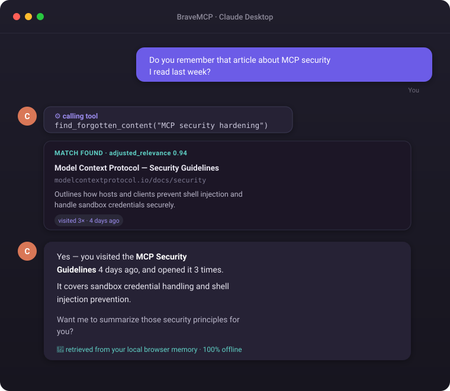

# BraveMCP — Your Browser Memory, Accessible by Claude

[](LICENSE)
[](CHANGELOG.md)
[](#)
[](https://modelcontextprotocol.io)

**BraveMCP** is a local-first browser extension + MCP server that captures everything you browse — pages, bookmarks, highlights, notes — and makes it searchable by Claude Desktop as a personal "second brain."

> Everything stays on your machine. No cloud. No tracking. Just your own memory, given to Claude.

---

## Demo

<!-- To use a real screen recording, record per docs/RECORDING.md, save it to
     docs/assets/demo.gif, and uncomment the line below (it takes priority). -->
<!--  -->



*Claude answers a vague "do you remember…" question by searching your local browser memory — fully offline. A real screen-recorded GIF can replace this mockup; see [docs/RECORDING.md](docs/RECORDING.md).*

---

## What It Does

| Without BraveMCP | With BraveMCP |
|---|---|
| "I don't have access to your history" | Claude searches your browsing history directly |
| You copy-paste URLs manually | Extension auto-captures pages as you browse |
| Forgotten tabs lost forever | Time-decay search resurfaces what you forgot |
| Manual research summaries | Claude synthesizes your sessions automatically |

### Example

> **You:** "Do you remember that article about MCP security I read last week?"
>
> **Claude:** *(calls `find_forgotten_content`)* → "Yes — you visited **MCP Security Guidelines** 4 days ago, 3 times. It covers sandbox credential handling and shell injection prevention. Want a summary?"

---

## How It Works

```
Brave Browser
    ↓ (tab visits, bookmarks, highlights)
Extension (Manifest V3)
    ↓ POST /api/...
HTTP Bridge (Express :3747)
    ↓
MCP Server ←→ SQLite + ChromaDB
    ↓ stdio JSON-RPC
Claude Desktop
```

- **Extension** — Manifest V3. Auto-captures tab changes, bookmarks, and context-menu text highlights.
- **HTTP Bridge** — Express server on port `3747`, runs inside the MCP server process to receive extension payloads.
- **Storage** — SQLite (FTS5 full-text search) + ChromaDB (local vector embeddings). Nothing leaves your machine.
- **AI Pipeline** — Ollama (`llama3.2` / `nomic-embed-text`) for local summarization and embeddings, with Anthropic API as fallback.
- **MCP Server** — Exposes 16 tools to Claude Desktop over stdio.

---

## Quick Start

### Prerequisites

- [Node.js](https://nodejs.org/) v18+
- [Brave](https://brave.com/) or Chrome browser
- [Claude Desktop](https://claude.ai/download)
- *(Optional)* [Ollama](https://ollama.com/) for local AI — `ollama pull llama3.2 && ollama pull nomic-embed-text`
- *(Optional)* Python 3.10+ for ChromaDB vector search — `pip install chromadb`

### Install

```bash
git clone https://github.com/glatinone/BraveMCP.git
cd BraveMCP
npm run setup
```

`npm run setup` handles everything: installs dependencies, builds TypeScript, and checks ports.

### Connect to Claude Desktop

Add this to `%APPDATA%\Claude\claude_desktop_config.json` (Windows) or `~/Library/Application Support/Claude/claude_desktop_config.json` (macOS):

```json
{
  "mcpServers": {
    "brave-memory": {
      "command": "node",
      "args": ["/absolute/path/to/BraveMCP/mcp-server/dist/index.js"]
    }
  }
}
```

Restart Claude Desktop.

### Load the Browser Extension

1. Open `brave://extensions` (or `chrome://extensions`)
2. Enable **Developer mode**
3. Click **Load unpacked** → select the `/extension` folder

### (Optional) Start ChromaDB for Semantic Search

```bash
pip install chromadb
chroma run --path ./storage/chroma
```

ChromaDB runs at `http://localhost:8000`. Without it, BraveMCP falls back to SQLite keyword search — still works great.

---

## Configuration

`npm run setup` creates a `.env` file at the project root from `.env.example`.
The MCP server reads it from there (not from `mcp-server/.env`), and re-reads
it on every AI call so changes take effect without a restart.

| Variable | Default | Purpose |
|---|---|---|
| `AI_PROVIDER` | `ollama` | `ollama` for local summarization/embeddings, or `anthropic` to use the Anthropic API instead |
| `OLLAMA_URL` | `http://localhost:11434` | Where the server looks for a running Ollama instance |
| `ANTHROPIC_API_KEY` | — | Required only if `AI_PROVIDER=anthropic`, or as a fallback when Ollama is unreachable |

Without Ollama or an Anthropic key, the AI pipeline falls back to genuine
extractive summaries built from real data (domain grouping, source listings)
instead of failing outright.

---

## Available MCP Tools

Once connected, Claude can call any of these 16 tools:

| Tool | What it does |
|------|-------------|
| `get_open_tabs` | Get your currently open browser tabs |
| `get_active_tab` | Get the tab you're looking at right now |
| `get_bookmarks` | Retrieve your saved bookmarks |
| `search_memory` | Keyword + semantic search across your history |
| `find_related_content` | Find pages related to a search query |
| `find_forgotten_content` | Resurface old content using time-decay + visit scoring |
| `capture_current_page` | Save the active page's content to memory |
| `save_note` | Save a freeform note |
| `save_bookmark` | Save a bookmark with a folder |
| `summarize_open_tabs` | Synthesize what you're currently researching |
| `summarize_research_topic` | Deep-dive summary on a specific topic from your history |
| `get_research_sessions` | Auto-clustered browsing sessions by domain/topic |
| `generate_weekly_digest` | Weekly summary of your browsing and research gaps |
| `suggest_tab_cleanup` | Recommends tabs to close, archive, or keep |
| `get_all_open_tabs` | Get the live, id-tagged array of every open tab — call first when organizing tabs |
| `apply_tab_grouping` | Apply semantic tab groups to the browser, validated by a critic engine (min score 90/100) before staging |

---

## Page Capture Flow

The extension auto-syncs tab visits in the background. For full page content (text body + AI summary), click **"Capture Content"** in the extension popup. This sends the page body to the MCP server, which stores it in SQLite and generates an AI summary and vector embedding.

Claude can also save a page directly: `capture_current_page(url, title, content, summary)`.

---

## Security

The HTTP bridge listens on `localhost:3747` for the extension only — but a
plain `localhost` server is reachable by *any* browser tab's JavaScript, not
just the extension, and by *any other installed browser extension*, not just
this one. The bridge enforces an `Origin` allowlist so that only an
extension origin (`chrome-extension://…` / `moz-extension://…`) or a
same-machine, non-browser client (no `Origin` header, e.g. a CLI script) can
call it. An ordinary website has no way to spoof its `Origin` header, so it
cannot reach `/api/capture`, `/api/note`, `/api/stage-groups`, etc. — closing
off a memory-poisoning path where a malicious page could otherwise plant
content into the local database that Claude later treats as trusted research.

A scheme check alone isn't enough, though: every installed extension gets an
equally legitimate `chrome-extension://<its-own-id>` origin, so it would let
a malicious or compromised *neighbor* extension talk to the bridge exactly as
freely as BraveMCP's own extension. The bridge closes this by pinning the
specific extension origin it sees on first contact (trust-on-first-use, the
same model SSH uses for host keys — `storage/trusted-origin.json`) and
rejecting every other extension origin afterward, with zero configuration.
If you ever need to re-pin (moved the repo to a new path, so the unpacked
extension gets a new ID), delete `storage/trusted-origin.json` and restart
the MCP server.

See `mcp-server/src/security/origin.ts`.

See [SECURITY.md](SECURITY.md) for the full threat model and how to report a
vulnerability.

---

## Troubleshooting

**Claude Desktop doesn't show the tools / "server disconnected"**
Use an absolute path to `mcp-server/dist/index.js` in `claude_desktop_config.json` — a relative path fails silently. Run `npm run build` first so `dist/` actually exists, then fully quit and reopen Claude Desktop (a config reload isn't enough).

**Port 3747 already in use**
Another BraveMCP instance (or a previous one that didn't shut down cleanly) is holding the HTTP bridge port. Find and stop it (`netstat -ano | findstr 3747` on Windows, then `taskkill /PID <pid> /F`), or restart your machine if unsure what's holding it.

**Semantic search feels weak / falls back to keyword search**
That means ChromaDB isn't reachable at `http://localhost:8000`. Run `chroma run --path ./storage/chroma` in a separate terminal and keep it running. This is optional — keyword search over SQLite still works without it.

**Summaries look generic / templated**
No Ollama and no `ANTHROPIC_API_KEY` were found, so the pipeline is using its extractive fallback (real data, no LLM). Either run `ollama pull llama3.2 && ollama pull nomic-embed-text` and start Ollama, or set `AI_PROVIDER=anthropic` and `ANTHROPIC_API_KEY` in `.env` (see [Configuration](#configuration)).

**Extension isn't capturing pages**
Confirm it's loaded at `brave://extensions` with Developer mode on, and that you clicked **Load unpacked** on the `/extension` folder specifically (not the repo root). After pulling new commits, click the extension's reload icon — Manifest V3 service workers don't hot-reload.

**A request to `/api/...` gets a 403**
That's expected outside the extension — the HTTP bridge only accepts `chrome-extension://`/`moz-extension://` origins (see [Security](#security)). Calling it from `curl` or a browser tab's console will always 403.

**Extension worked before, now every request 403s ("Origin not allowed")**
The bridge pins the extension's origin on first contact and only trusts that exact origin afterward (see [Security](#security)). If you moved/re-cloned the repo (the unpacked extension gets a new ID at a new path) or loaded a second copy of the extension, the pinned origin no longer matches. Delete `storage/trusted-origin.json` and restart the MCP server to re-pin against whichever extension talks to it next.

---

## Project Structure

```
BraveMCP/
├── extension/              # Manifest V3 browser extension
│   ├── background.js       # Service worker: tab sync, bookmarks
│   ├── content.js          # DOM extraction for page capture
│   ├── manifest.json
│   └── popup/              # Extension UI
├── mcp-server/             # Node.js MCP server
│   ├── src/
│   │   ├── index.ts        # MCP tools + Express HTTP bridge
│   │   ├── storage/
│   │   │   ├── database.ts # SQLite schema, FTS5, migrations
│   │   │   └── chroma.ts   # ChromaDB client
│   │   └── ai/
│   │       └── pipeline.ts # Embeddings + summarization pipeline
│   └── tsconfig.json
├── scripts/
│   └── setup.js            # One-command setup script
├── storage/                # SQLite DB + trusted-origin.json (git-ignored)
└── package.json            # Root: runs setup script
```

---

## Roadmap

- [x] Phase 1 — MCP server scaffold
- [x] Phase 2 — SQLite storage layer (FTS5, migrations)
- [x] Phase 3 — Browser extension (Manifest V3)
- [x] Phase 4 — Vector search + AI pipeline (Ollama / Anthropic fallback)
- [x] Phase 5 — Advanced tools (digest, sessions, forgotten content, tab cleanup)
- [x] Phase 6 — Polish + public release (v0.2.0: tests, CI, lint, security hardening)
- [x] Phase 7 — Origin-trust hardening (v0.3.0: extension-origin pinning via trust-on-first-use)

---

## Contributing

See [CONTRIBUTING.md](CONTRIBUTING.md) for guidelines.

## License

[MIT](LICENSE) — built by Yehezkiel Tampubolon
