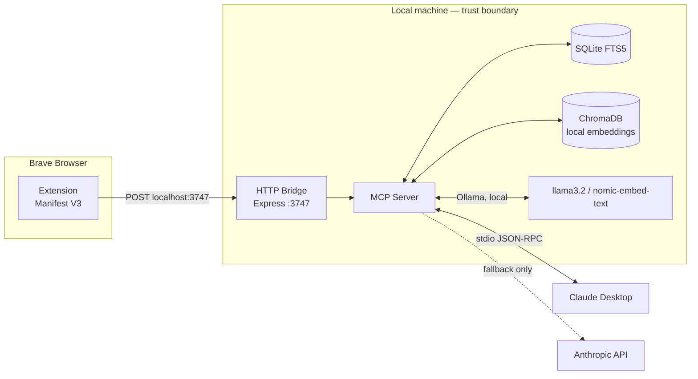

# Threat Model — BraveMCP

STRIDE-based threat model for BraveMCP: a browser extension that captures browsing activity and a local MCP server that makes it searchable by Claude Desktop.

## 1. System Overview

## 2. Trust Boundaries & Data Flow

| Boundary | Description |
|---|---|
| **B1 — Web content ↔ Extension** | Every page the user visits is untrusted content that the extension reads (title, URL, highlighted text). A malicious page is the primary adversary here. |
| **B2 — Extension ↔ HTTP Bridge (localhost:3747)** | Local-only by default, but "local-only" is a network claim, not a cryptographic one — any other local process or, on a misconfigured system, another user/container sharing the network namespace can reach `localhost:3747` too. |
| **B3 — HTTP Bridge ↔ MCP Server ↔ Storage** | Internal to the same process tree; the main risk here is data at rest (SQLite + ChromaDB files) being readable by other local processes/users. |
| **B4 — MCP Server ↔ Claude Desktop** | stdio JSON-RPC, process-to-process — inherits Claude Desktop's own MCP trust model. |
| **B5 — MCP Server ↔ Anthropic API (fallback only)** | The one boundary where local data leaves the machine. Explicitly a fallback, not the default path — this distinction is safety-critical and must stay true as the project evolves. |

## 3. STRIDE Threat Matrix

| Category | Threat | Applies? | Notes |
|---|---|---|---|
| **Spoofing** | Another local process impersonates the extension and POSTs fabricated browsing history into the bridge, poisoning what Claude later "remembers" | **Yes** | The HTTP Bridge should authenticate the extension as its caller (e.g. a shared local token set at install time), not accept any POST to `:3747` at face value. |
| **Tampering** | A malicious webpage crafts its title/content/highlighted text to inject prompt-injection payloads that later get replayed verbatim into Claude's context when the memory is retrieved | **Yes — primary threat** | This is the same class of risk mcpscan's `tool_poisoning` rule targets, but here the injection vector is *captured browsing content*, not tool metadata. Captured page content should be treated as untrusted data when it's later surfaced to Claude, not as trusted first-party memory. |
| **Repudiation** | Extension silently fails to capture a page (e.g. bridge is down) with no user-visible signal, giving false confidence that "everything is being remembered" | Yes | Capture failures should be visible in extension UI state, not silent. |
| **Information Disclosure** | Sensitive pages (banking, health, private messages) get captured and stored in plaintext SQLite/ChromaDB, then later surfaced by Claude in a context the user didn't expect (e.g. screen-shared session) | **Yes — primary threat given the product's whole premise is capturing everything** | Needs explicit exclusion rules (domain denylist, incognito/private-window exclusion, per-site opt-out) rather than capture-everything-by-default with no filtering. |
| **Denial of Service** | High-frequency tab switching or a page that mutates its DOM rapidly (triggering repeated highlight-capture events) floods the bridge/SQLite writes | Low-medium | Debouncing on the extension side; not a high-severity path since it only affects the local user's own machine. |
| **Elevation of Privilege** | The Express bridge on `:3747` has no auth, so any other local application (including malware) can read the full captured browsing history and write fabricated entries via the same open HTTP endpoint | **Yes — highest severity** | Binding to `127.0.0.1` prevents *remote* access but does **not** prevent *other local processes* from reaching the port. This is the single most important gap to close: local-only ≠ authenticated. |

## 4. Identified Attack Vectors

- **Context bleeding via captured content** — page content is stored and later re-injected into Claude's context verbatim; a malicious page can plant instructions that only "fire" when the memory is retrieved days later, decoupled from the moment the user was looking at the page.
- **Unauthenticated local bridge** — `:3747` accepts writes from any local caller, not just the legitimate extension instance.
- **Data-at-rest exposure** — SQLite/ChromaDB files are unencrypted local storage; anyone with filesystem access to the user's profile (another OS user, a stolen laptop with FDE off, another app with broad disk permissions) can read the full browsing memory.
- **Sensitive-domain capture** — no denylist means health/banking/private-messaging pages are captured by default.

## 5. Security Controls & Mitigations Implemented

| Control | Implementation |
|---|---|
| Local-first architecture | No cloud sync; default AI pipeline (Ollama) runs fully offline — removes the network exfiltration path for the common case |
| Explicit fallback boundary | Anthropic API use is called out as fallback, not default, in the README — keeps the one genuine data-leaves-machine path opt-in and visible |
| stdio transport to Claude Desktop | Avoids exposing the MCP server itself over a network socket to Claude |

## 6. Recommended Hardening (not yet implemented — tracked here for transparency)

- Add a shared local auth token between the extension and the HTTP Bridge, generated at install time, so `:3747` isn't wide open to any local process.
- Add a domain denylist / private-window exclusion for capture, with sane defaults for common sensitive-domain patterns (banking, health).
- Treat retrieved memory content as untrusted context when constructing prompts back to Claude — i.e., don't let captured page text carry the same trust level as the user's own direct input.
- Consider at-rest encryption for the SQLite/ChromaDB store, keyed to OS-level user credentials.
